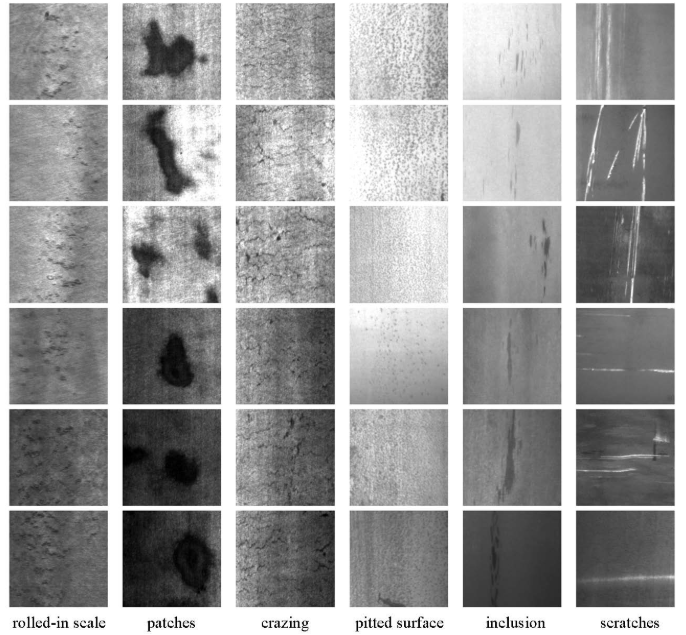

# PaddleClas_NEU(基于PaddleClas的热轧钢带表面缺陷分类)</br>

本项目为PaddleClas套件的应用类教程，通过使用东北大学（NEU）表面缺陷数据库，详细说明了PaddleClas在使用流程以及注意事项

**AI Studio 项目地址**:  https://aistudio.baidu.com/aistudio/projectdetail/685319</br>
**数据集下载链接**: Google-Drive：https://drive.google.com/file/d/1NGlXT9sIaQpyxUoT6MLKm1Pr6x8oxOvc/view 

## PaddleClas
飞桨图像分类套件PaddleClas是飞桨为工业界和学术界所准备的一个图像分类任务的工具集，助力使用者训练出更好的视觉模型和应用落地

<div align="center">
    
</div>

**文档教程**: https://paddleclas.readthedocs.io

**30分钟玩转PaddleClas**: https://paddleclas.readthedocs.io/zh_CN/latest/tutorials/quick_start.html


## NEU表面缺陷数据库
在热轧带钢的生产过程中受制造工艺、生产条件和原材料质量等相关问题的制约，生产出的工业产品往往存在缺陷。热轧带钢表面缺陷种类较多，其中常见的六种典型表面缺陷即轧制氧化皮，斑块，开裂，点蚀表面，内含物和划痕。这些缺陷会在带钢后续产品的使用过程中造成隐患，导致制造产品质量下降。因此准确、快速的判断缺陷的类型是非常有必要的。
热轧钢带的六种典型表面缺陷分别为轧制氧化皮（RS），斑块（Pa），开裂（Cr），点蚀表面（PS），内含物（In）和划痕（Sc）。该数据库包括 1,800 个灰度图像：六种不同类型的典型表面缺陷各含300 个样本数据，图像的原始分辨率为 200×200。

* 下表列出了六种典型表面缺陷的类型与外观特征：

| 缺陷类型	    |外观特征| 
| -------- | -------- | 
| 轧制氧化皮    | 通常呈小斑点、鱼鳞状、条状、块状不规则分布于带钢上、下表面的全部或局部，常伴有粗糙的麻点状表面。   
| 斑块        | 在带钢的表面呈现片状或大面积的斑迹，个别的情况下在某个角度上有向外辐射的迹象。
| 点蚀表面     | 带钢表面有局部的或连续的粗糙面，严重时呈桔皮状。在上下表面都可能出现，而且在整个带钢长度方向上的密度不均。
| 开裂        | 轧件表面一种不连续的裂纹，它以某点为中心，以闪电状向外发散。
| 内含物       | 板带钢表面的薄层折叠，缺陷常呈灰白色，其大小、形状不一，不规则分布于板带钢表面。
| 划痕        | 轧件表面的机械损伤，其长度、宽度、深度各异。主要出现在沿轧制方向或垂直于轧制方向上。
* 如图展示了六种典型表面缺陷的样本图像。类内缺陷在外观上存在很大差异，例如，划痕（最后一列）可能是水平划痕，垂直划痕和倾斜划痕等。同样，类间缺陷也具有类似情况，例如，氧化皮，裂纹和表面凹痕。另外，由于照明和材料变化的影响，类内缺陷图像的灰度是变化的。
<div align="center">
    
</div>

## 	安装说明

## 1. 简介

本章将介绍如何安装PaddleClas及其依赖项。

## 2. 安装PaddlePaddle

运行PaddleClas需要PaddlePaddle Fluid v1.7或更高版本。请参照[安装文档](http://www.paddlepaddle.org.cn/install/quick)中的说明进行操作。

如果已经安装好了cuda、cudnn、nccl或者安装好了docker、nvidia-docker运行环境，可以pip安装最新GPU版本PaddlePaddle

```bash
pip install paddlepaddle-gpu --upgrade
```

**运行环境需求:**

- Python3 (当前只支持Linux系统)
- CUDA >= 9.0
- cuDNN >= 5.0
- nccl >= 2.1.2

## 3. 安装PaddleClas

**克隆PaddleClas模型库：**

```
#1.使用原始的PaddleClas套件，并下载数据集移至指定位置
git clone https://github.com/PaddlePaddle/PaddleClas.git
#2.本项目集成好的PaddleClas套件以及数据集
git clone https://github.com/lxk767363331/PaddleClas_NEU.git
```

**安装Python依赖库：**

Python依赖库在[requirements.txt](https://github.com/lxk767363331/PaddleClas_NEU/blob/master/requirements.txt)中给出，可通过如下命令安装：

```
pip install --upgrade -r requirements.txt
```

visualdl可能出现安装失败，请尝试

```
pip3 install --upgrade visualdl==2.0.0b3 -i https://mirror.baidu.com/pypi/simple

```
## 4. 环境准备

**设置PYTHONPATH环境变量**
```bash
export PYTHONPATH=./:$PYTHONPATH
```
**在notebook中可以用os.environ设置环境变量**
```bash
cd PaddleClas
import os 
os.environ['PYTHONPATH']="PaddleClas的根路径"
```


## 	数据处理

解压数据集并将数据集移动至指定位置，通过代码生成训练集文件夹、测试集文件夹、标签文件以及相应的路径txt文件。修改数据处理文件中的数据集根路径即可[data.py](https://github.com/lxk767363331/PaddleClas_NEU/data.py)。

* 需要注意的是：
    * 数据集存放的位置与生成的数据列表文件中的数据路径需要与配置文件对应，这也是初学者时常出现问题的地方。
    * 数据列表文件中路径与标签之间的分割符号，行与行之间的换行符号
    
## 	模型选择参数配置

数据预处理之后，选择网络并训练网络,本项目选择的网络是ResNet_vd，基于PaddlePaddle复现的ResNet网络结构的代码分析可通过这里查看[ResNet](https://aistudio.baidu.com/aistudio/projectdetail/438756)

在PaddleClas/configs/ResNet/ResNet50_vd.yaml中的修改必要参数,例如：
- classes_num: 6  分类数  
- total_images: 1431  总图片数  
- save_interval: 10  每隔多少个epoch保存模型  
- validate: True  是否在训练时评估  
- valid_interval: 10    每隔多少个epoch进行模型评估  
- epochs: 50  训练总epoch数  
- image_shape: [3, 224, 224]  图片大小  
- TRAIN:  
- batch_size: 64  批大小  
- num_workers: 4  数据读取器worker数量  
- file_list: "./dataset/NEU-CLS/train.txt"  train文件列表  
- data_dir: "./dataset/NEU-CLS"  train文件路径 

关于学习率的设置：

大部分的神经网络选择的初始学习率为0.1，batch_size是256，所以根据实际的模型大小和显存情况，可以将学习率设置为0.1 * k, batch_size是256设置为256 * k。

更多的训练技巧与参数设置可以关注paddleclas的[技术文档](https://paddleclas.readthedocs.io/zh_CN/latest/models/Tricks.html)，其对相关参数进行了详细的解释说明。

## 	模型训练

使用已经配置好的neu.yaml文件，通过如下的方式启动训练：

```bash
python -m paddle.distributed.launch --selected_gpus="0" tools/train.py \  
	     -c ./configs/ResNet/ResNet50_vd.yaml   #配置文件路径
```
注意：
-PaddleClas通过launch方式启动多卡多进程训练 通过设置FLAGS_selected_gpus 指定GPU运行卡号。
-本次项目中设置的是阶段性模型评估，并保存预测接估计最好的模型在PaddleClas/output/ResNet50_vd/best_model，best_model下包含ppcls.pdmodel、ppcls.pdopt、ppcls.pdparams三个文件用来进行后续的评估推理使用。

## 	模型评估

首先需要修改评估所需的配置文件，修改方式有两种：
- 直接修改configs/eval.yaml
- -o参数更新配置
这里建议在configs/eval.yaml中修改必要的参数，使用-o设置需要评估的模型路径较为方便。
需要注意的是加载模型时，需要指定模型的前缀，如模型参数所在的文件夹为output/ResNet50_vd/ best_model，模型参数的名称为output/ResNet50_vd/ best_model /ppcls.pdparams，则pretrained_model参数需要指定为output/ResNet50_vd/ best_model /ppcls，PaddleClas会自动补齐.pdparams的后缀。通过如下的方式启动评估：

```bash
python -m paddle.distributed.launch --selected_gpus="0" tools/eval.py \  
	     -c ./configs/eval.yaml \   #配置文件路径
       -o pretrained_model=output/ResNet50_vd/best_model/ppcls  #评估模型路径
```

## 	模型推理

PaddlePaddle模型的保存方式大致分为以下两种：

- persistable 模型（fluid.save_persistabels保存的模型） 一般做为模型的 checkpoint，可以加载后重新训练。persistable 模型保存的是零散的权重文件，每个文件代表模型中的一个 Variable，这些零散的文件不包含结构信息，需要结合模型的结构一起使用。
- inference 模型（fluid.io.save_inference_model保存的模型） 一般是模型训练完成后保存的固化模型，用于预测部署。与 persistable 模型相比，inference 模型会额外保存模型的结构信息，用于配合权重文件构成完整的模型。如下所示，model 中保存的即为模型的结构信息。

根据模型的保存方式以及选择引擎的不同，PaddlePaddle衍生出三种方式进行预测推理：

- 预测引擎 + inference 模型
- 训练引擎 + persistable 模型
- 训练引擎 + inference 模型

本文选择使用 预测引擎 + inference模型的方式完成模型推理，执行步骤如下：

**选择训练好的模型并转化为inference 模型：**

```bash
python tools/export_model.py \  
    --model='ResNet50_vd'    \   #模型名称
	  --pretrained_model=output/ResNet50_vd/best_model/ppcls \  #需要转换的模型路径
    --output_path=./inference  #输出的预测模型保存路径
```

保存在Inference目录下的预测模型包含 model、params 两个文件。

**通过预测引擎和inference模型进行推理：**

```bash
python tools/infer/predict.py --use_gpu=1  \  #是否使用 GPU 预测
	    -m inference/model \  #模型文件路径
	    -p inference/params \  #权重文件路径
      -i "dataset/NEU-CLS/Rs/RS_5.bmp"    #待预测的图片文件路径
```

## 总结

本项目使用了PaddlePaddle深度学习框架以及PaddleClas套件，在AI Studio上完成了数据处理、模型训练、模型评估推理等工作。PaddleClas套件让图像分类技术变得更为简单便捷，降低了开发者的上手难度。

在此强烈安利AI Studio。AI Studio是基于百度深度学习平台飞桨的人工智能学习与实训社区，提供在线编程环境、免费GPU算力、海量开源算法和开放数据，帮助开发者快速创建和部署模型。


如在使用过程中有问题，可加入飞桨官方QQ群进行交流：1108045677。如果您想详细了解更多飞桨的相关内容，请参阅以下文档。

官网地址：
https://www.paddlepaddle.org.cn

飞桨开源框架项目地址：

GitHub:
https://github.com/PaddlePaddle/Paddle

Gitee: 
https://gitee.com/paddlepaddle/Paddle


